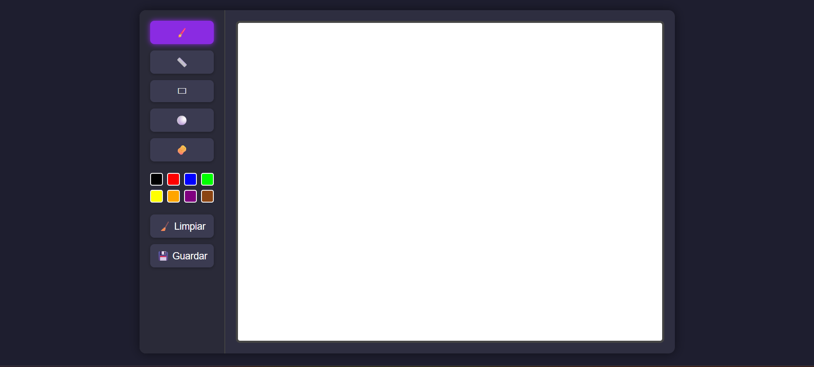
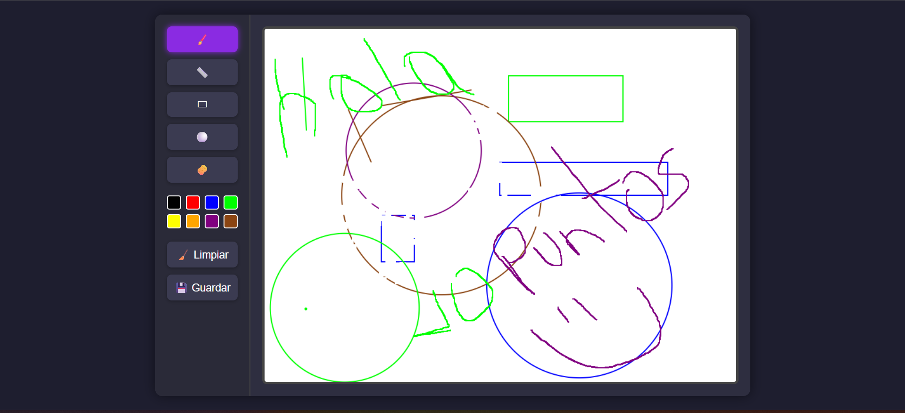
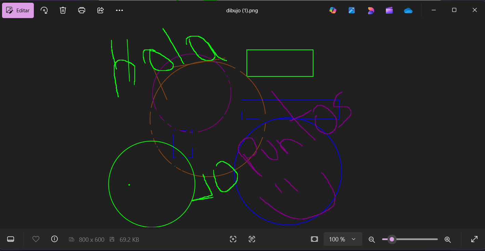

# Paint Web 🎨

Aplicación web de dibujo estilo Paint desarrollada para permitir que ciudadanos creen mapas conceptuales del campus universitario.

## 🛠 Herramientas disponibles

- 🖌️ Pincel libre
- 📏 Línea recta
- ▭ Rectángulo
- ⚪ Círculo
- 🧽 Borrador

## 🎨 Paleta de colores

Incluye 8 colores básicos:
Negro, rojo, azul, verde, amarillo, naranja, morado y café.

## ✅ Funcionalidades

- Área de dibujo (canvas) de 800x600 px
- Toolbar lateral con herramientas
- Colores seleccionables
- Borrado de lienzo completo
- Guardar como imagen PNG
- Cursor y feedback visual según herramienta activa

## 🧪 Uso

1. Selecciona una herramienta y color.
2. Dibuja en el canvas con el mouse.
3. Presiona **Guardar** para exportar el dibujo.
4. Usa **Limpiar** para reiniciar.

## 📷 Capturas

## 🚀 Deploy

Puedes probar el proyecto abriendo `index.html` en tu navegador.
